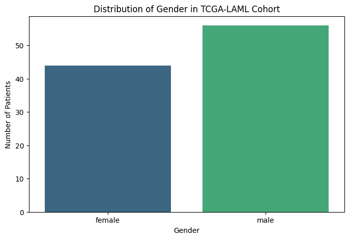

# 🧬 Integrated Multi-Omics Analysis for AML Biomarker Discovery


## 📌 Abstract
Acute Myeloid Leukemia (AML) is a heterogeneous hematological malignancy. This study presents a computational pipeline for integrated multi-omics analysis using **TCGA-LAML** data. By merging Clinical, RNA-Seq (TPM normalized), and somatic mutation data, we identified key biomarkers associated with disease progression and patient survival.

---

## 📊 Visualized Results

### 1. Cohort Demographics & Baseline
| Gender Distribution | Age at Diagnosis |
|---|---|
|  |  |

### 2. Survival Analysis & Risk Stratification
This represents the primary milestone: integrating transcriptomic biomarkers with clinical survival data.
<p align="center">
  
</p>

> **Scientific Insight:** A significant survival difference between molecular risk groups was observed (**p < 0.001**), highlighting the prognostic value of genomic features beyond clinical variables such as age.

### 3. Clinical Benchmarking
<p align="center">
  
  
</p>

---

## ⚙️ Methods
* **Data Processing:** RNA-Seq normalization (TPM), Mutation filtering (Non-synonymous variants).
* **Survival Analysis:** Kaplan–Meier estimator & Log-rank testing.
* **Integration:** Merging clinical demographics with *TP53* mutation status and *MT-RNR2* expression.

---

## 🧠 Discussion
This study demonstrates that multi-omics integration reveals hidden biological patterns. **TP53** remains a central prognostic driver, while **mitochondrial gene expression** suggests metabolic dysregulation in AML cells. Although limited by a single cohort, this framework provides a reproducible basis for predictive modeling.

---

## 📁 Project Structure
```bash
├── data/               # Raw and processed clinical/genomic data
├── scripts/            # Python scripts for acquisition & analysis
├── results/            # Statistical outputs and tables
├── figures/            # Visualizations (PNG/PDF)
└── README.md           # Project documentation
